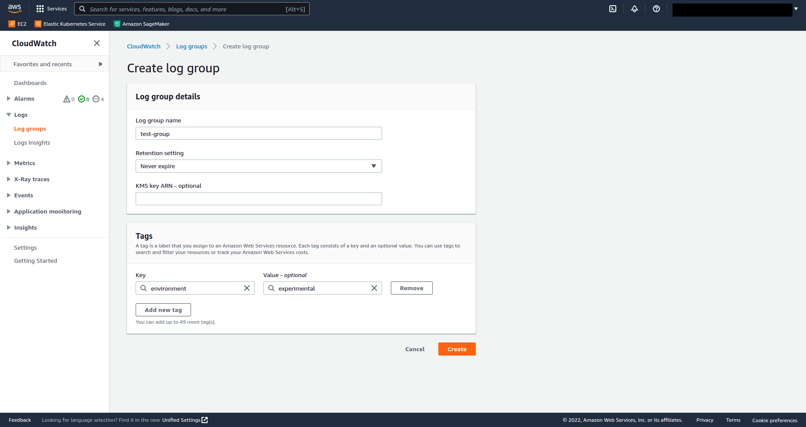
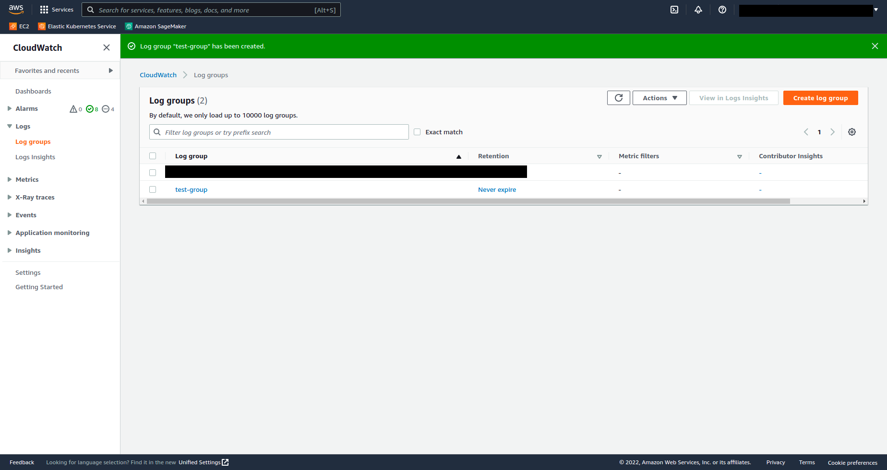
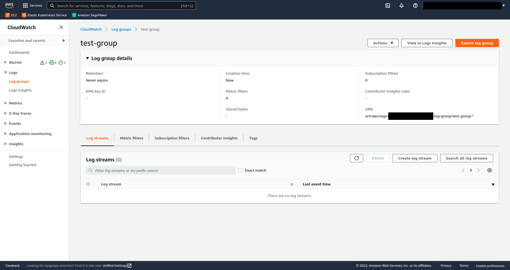
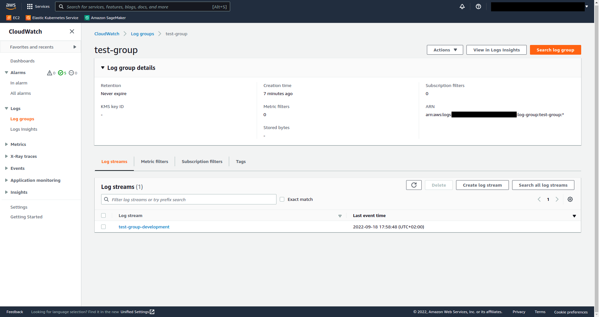
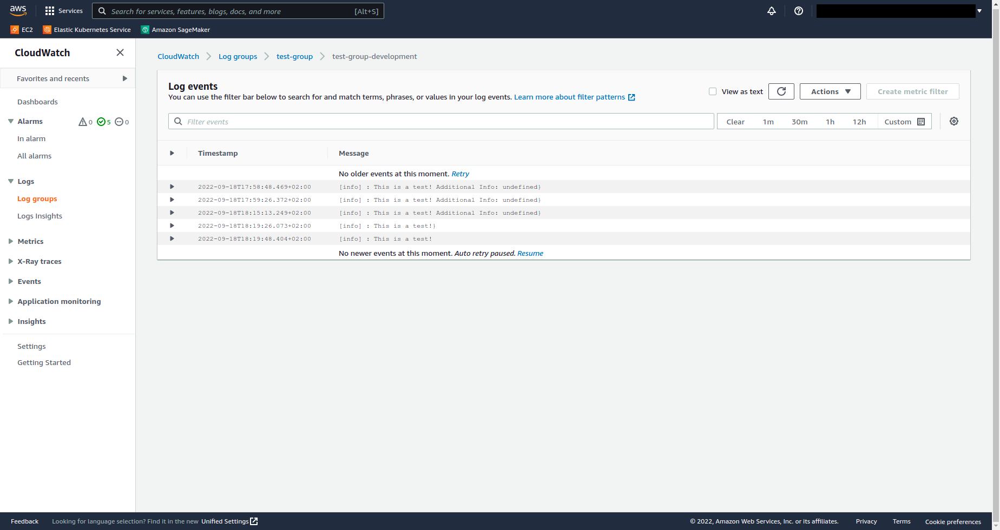

# LABORATORY-AWS-CLOUDWATCH

This laboratory is a tutorial/example how to use winston to register log in the AWS Cloudwatch. For this laboratory, I have used **NX** to create my workspace, **Express.js** to create an API, **Winston** as a logger and **Winston-cloudwatch** library to make the connection.

## Plan of the presentation

I explain with all the details how I build the project and my way of working.

- [Price](#price)
- [Development](#development)
- [Running](#running)
- [System](#system)

## Price

The price can be found here: [AWS Price](https://aws.amazon.com/cloudwatch/pricing/)

At the moment of writing those line, the price is around 0.5$ for each GB over 5GB. It's pretty cheap, if you have 1TB of logs, it will be around 500$ a month. For reducing the cost, I can also play with the retention to automatically remove the log too old.

## Development

#### Create log group

Now, I need to create a log group. For doing so, I browse for the AWS Cloudwatch service and click on the button `Create Log Group`.



After filling up everything, I click `Create`.
Pay attention to the tag, it can be useful for searching your logs group when you have a lot.



I can now enter in the group. Obviously, there is nothing inside since we have not create the code for sending log.



#### Code

The code can be found in the logger `winston.js` located in the api/src/app/logger. This file has been filled up for using the winston library and exporting the logger that we will use. The part that is interesting is at the bottom of the file. I am creating a transporter using `winston-cloudwatch`. My keys has been filled up in the environment variable.

```js
const cloudwatchConfig = {
  logGroupName: process.env.CLOUDWATCH_GROUP_NAME,
  logStreamName: `${process.env.CLOUDWATCH_GROUP_NAME}-${process.env.NODE_ENV}`,
  awsOptions: {
    credentials: {
      accessKeyId: process.env.ACCESS_KEY,
      secretAccessKey: process.env.SECRET_ACCESS_KEY,
    },
    region: process.env.REGION,
  },
  retentionInDays: 30,
  name: "Test",
  messageFormatter: ({ level, message, additionalInfo }) => {
    const data = additionalInfo
      ? `\nData: ${JSON.stringify(additionalInfo)}`
      : "";

    return `[${level}] ${message}${data}`;
  },
};

logger.add(new WinstonCloudWatch(cloudwatchConfig));
```

For more information on this library: [winston-cloudwatch](https://www.npmjs.com/package/winston-cloudwatch)

#### Logs in Cloudwatch

I have now some streams that has been filled up in my cloudwatch. The information is organized using the `logStreamName` that we have specified in the `winston-cloudwatch` library in the file `winston.js`.



After clicking on it, I can now see the events that has been logged.
And If I click on it, I can see additionnal information.



## Running

I am using NX, so for starting the project use the following command:

```bash
$ nx serve api
```

For testing the app, use Postman.

## System

Ubuntu Version: Ubuntu 20.04.1 LTS
Node Version: v16.15.1

```bash
# Get the version of node
$ node -v

# Get the latest version of ubuntu
$ lsb_release -a
```
